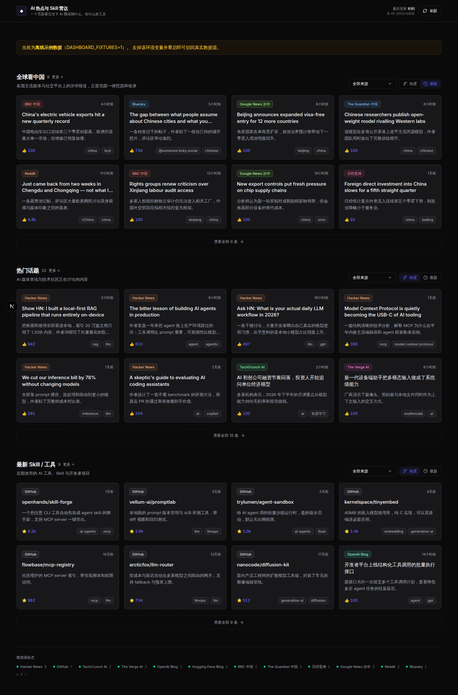

# AI 热点与 Skill 雷达

一个页面看完当下 AI 圈在讨论什么、有什么新工具/Skill 发布。个人用的本地看板，无登录、无数据库。



<sub>截图跑在 `DASHBOARD_FIXTURES=1` 的离线示例数据下，所以顶部有黄色提示条；接真实数据源时没有这一条。</sub>

## 快速开始

```bash
npm install
npm run dev
```

打开 http://localhost:3000 即可，无需任何配置。想调整可选项就复制 `.env.example` 成 `.env.local`。

## 它做什么

页面分成三个独立板块，不做统一信息流：

| 板块 | 内容 | 数据来源 |
|---|---|---|
| **全球看中国** | 各国媒体与社交平台的涉华报道 | BBC、Guardian、NYT、SCMP、Al Jazeera、DW、France 24、日经亚洲、The Diplomat、NPR、Google News 聚合、Reddit、Bluesky、X（可选） |
| **热门话题** | AI 资讯 + 社区讨论 | Hacker News、TechCrunch AI、The Verge AI、Ars Technica、VentureBeat、MIT Tech Review |
| **最新 Skill / 工具** | 新发布的工具与项目 | GitHub Search、OpenAI Blog、Hugging Face Blog |

### 全球看中国

这个板块只做**主题过滤，不做立场过滤** —— 关键词只用来判断「是不是在讲中国」，不参与判断「讲得好不好」。正面、负面、中性的报道一律照原样收录，代码里没有、也不打算加任何情绪或倾向判分。

信源刻意覆盖不同地区和立场（英美、欧洲、中东、亚太、港媒），再加上 Reddit 和 Bluesky 的网民议论，这样「整体感知」才不是单一视角的回声。卡片上始终显示来源名，二级页可以按来源筛选，方便对比同一件事不同媒体怎么写。

关于 X：X 在 2023 年取消了免费的搜索 API，recent search 现在属于付费档位。所以 X 源**默认未启用**（页脚显示灰点，不算故障），填了 `X_BEARER_TOKEN` 会自动接上。社交平台那部分观感由 Reddit 和 Bluesky 承担 —— 两者都免费、免登录，Bluesky 的公共搜索接口是目前唯一还能白嫖的「X 式」全站搜索。

### 首页与二级页

**首页每个板块只露两行**，保证一屏之内看完不用滚。两行是按断点算的：手机 2 张、平板 4 张、桌面 6-8 张。想看全部就点标题旁的「更多」或列表底部的「查看全部 N 条」，进到该板块的完整列表页（`/topics`、`/tools`）。

**点卡片直接在新标签页打开原文**，没有中间弹窗。用新标签页是因为看板本身会定时自动刷新，在当前页跳走会把看板顶掉。

两个板块、以及二级页，都支持按来源筛选和「热度 / 最新」排序切换。

Header 有手动刷新按钮（带 loading 态）和最后更新时间，点左上角标题可以随时回首页；页面开着时每 45 分钟自动刷新一次，靠前端定时器实现，没有服务端常驻任务。

## 数据源都不要 API Key

| 源 | 接入方式 | 限额 |
|---|---|---|
| Hacker News | Algolia HN Search API | 免 Key |
| GitHub | REST Search API，按 topic + star + 创建时间过滤 | 未认证 60 次/小时，配 token 可提额 |
| RSS | `rss-parser` 解析各媒体分类 feed | 无 |
| Reddit | 公开 `.json` 接口 | 免 Key，但对 User-Agent 敏感 |
| Bluesky | 公共 AppView `searchPosts` | 免 Key、免登录 |
| X | API v2 recent search | **需付费 token，默认未启用** |

后端有 5 分钟内存缓存，所以正常翻页不会反复打上游；点手动刷新会带 `?refresh=1` 跳过缓存真正回源。

**任何一个源挂掉都不会影响其它源** —— 失败的源会在页脚「数据源状态」里标红，页面照常展示其余内容。

## 改关键词和信源

抓取逻辑里没有写死任何关键词，全部集中在 [`config/keywords.ts`](config/keywords.ts)：

AI 板块的在 [`config/keywords.ts`](config/keywords.ts)，涉华板块的在 [`config/china.ts`](config/china.ts)，结构一样：

- `AI_KEYWORDS` / `CHINA_KEYWORDS` — 命中任意一个就算相关（HN、综合媒体需要过滤，本身就是 AI 专属的源不过滤）
- `NOISE_KEYWORDS` / `CHINA_NOISE_KEYWORDS` — 反向过滤，挡掉 "real estate agent"、"bone china" 这类误伤
- `HN_QUERIES` / `HN_MIN_POINTS` — HN 搜哪些词、多少分以上才展示
- `GITHUB_TOPICS` / `GITHUB_MIN_STARS` / `GITHUB_RECENT_DAYS` — GitHub 的 topic 与门槛
- `RSS_FEEDS` / `CHINA_FEEDS` — 增删 RSS 源，顺便决定它归到哪个板块
- `REDDIT_QUERIES` / `BLUESKY_QUERIES` / `X_QUERIES` — 社交平台搜什么、多少互动量才收

短关键词（`ai`、`llm`、`gpt` 等 3 字符以内）走词边界匹配，不会被 "chair"、"rail" 这类词误命中。

## API

前端只请求 `/api/dashboard`，聚合、去重、排序都在后端做。

```
GET /api/sources/hn        单独看 Hacker News 抓到了什么
GET /api/sources/github    单独看 GitHub
GET /api/sources/rss       单独看各 AI RSS 源（按源分开返回）
GET /api/sources/china     单独看涉华源（各国媒体 + Reddit + Bluesky + X）
GET /api/dashboard         聚合结果
    ?sourceType=china_watch|news|skill_tool|community
    ?sort=score|date
    ?refresh=1             跳过 5 分钟缓存
```

所有源都统一转换成同一个 [`ContentItem`](lib/types.ts)，前端不感知任何第三方 API 的原始结构。去重先按 id、再按规范化 URL（去掉 www / query / hash），同一篇文章同时出现在 HN 和 RSS 里时保留热度高的那条。

## 环境变量

全部可选，见 [`.env.example`](.env.example)：

- `DASHBOARD_GITHUB_TOKEN` — GitHub 只读 token，把 60 次/小时提到 5000 次/小时
- `X_BEARER_TOKEN` — X API v2 的 Bearer Token，填了才启用 X 源
- `NEXT_PUBLIC_REFRESH_INTERVAL_MINUTES` — 自动刷新间隔，默认 45；调成 `0.1` 可以在 20 秒内验证自动刷新逻辑
- `DASHBOARD_FIXTURES=1` — 用内置离线示例数据，一个第三方接口都不打，适合断网开发。启用时页面顶部会有醒目提示，不会被误当成真实数据

## 技术栈

Next.js 16（App Router）+ TypeScript + Tailwind CSS v4 + Radix UI（Select，shadcn/ui 风格组件直接放在 `components/ui/`）+ SWR。

首页和二级页共用同一个 SWR key，从首页点进「更多」不会重新打接口。

## 目录

```
config/keywords.ts     AI 板块的关键词、信源、阈值
config/china.ts        涉华板块的关键词、信源、阈值
lib/types.ts           ContentItem 统一数据模型
lib/sources/           各数据源的抓取 + 转换（hn / github / rss / reddit / bluesky / x）
lib/aggregate.ts       聚合、去重、排序
lib/cache.ts           5 分钟内存缓存（含并发请求合并）
lib/sections.ts        两个板块的定义，首页与二级页共用
lib/use-dashboard.ts   SWR 数据 hook（自动刷新 + 手动刷新）
lib/fixtures.ts        离线示例数据
app/api/               API Routes
app/china/             「全球看中国」完整列表页
app/topics/            「热门话题」完整列表页
app/tools/             「最新 Skill / 工具」完整列表页
components/            看板 UI
```

## 部署到 Vercel

推到 GitHub 后 Vercel 会自动构建，但有三件事容易踩：

1. **只有生产分支的推送才会更新正式域名。** Vercel 项目里设的 Production Branch（通常是 `main`）之外的分支，推上去只生成 Preview 部署，是另一个临时网址，正式域名不动。
2. **环境变量必须在 Vercel 后台填。** `.env.local` 不会被提交，Vercel 读不到。至少要填 `DASHBOARD_GITHUB_TOKEN` —— GitHub 未认证的 60 次/小时是按 IP 算的，Vercel 的出口 IP 和大量其它项目共享，不填基本必被限流。**别**在 Vercel 上设 `DASHBOARD_FIXTURES`，否则线上全是示例数据。
3. **内存缓存在 Serverless 上命中率低。** 缓存是进程内变量，Vercel 每个函数实例各有一份，实例回收后就没了。功能不受影响，只是回源比本地频繁一些 —— 这也是上一条要配 token 的原因。

抓取涉及十几个境外源，所以聚合接口标了 `maxDuration = 30`，单个源的 fetch 超时收在 8 秒，避免顶到 Hobby 档的函数时长上限。

## 明确不做

无用户体系、无数据库、无历史趋势、无全网爬虫、无搜索框、无收藏、无服务端 cron、无详情弹窗。只展示当前快照。

涉华板块另外明确**不做情绪/倾向判分**：关键词只判主题不判立场，好坏由你自己看。
